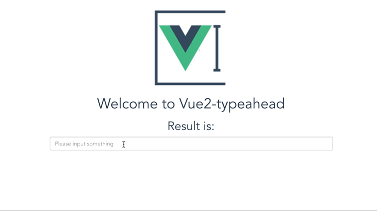

# vue2-typeahead

> typeahead for vue2  
> Based on[https://github.com/pespantelis/vue-typeahead](https://github.com/pespantelis/vue-typeahead)

## Quick preview


## Run demo

``` bash
# install dependencies
npm install

# serve with hot reload at localhost:8080
npm run dev

```

## How to use
1. Please install axios ``` npm install axios --save ```  
2. ```  ```
3. import and use it
4. you can get a config sample from Demo.vue

### Sample
```
 <TypeAhead
      src="/static/data.json?keyword=:keyword"
      :getResponse="getResponse"
    ></TypeAhead>

```
```
methods: {
      getResponse: function (response) {
        return response.data.items
      }
    }
```

## Config props
### v-model
You can get the result by set ```v-model=""``` attribute
### Necessary
1. **src**: The api url for get the data
2. **getResponse**: The function to get a array form response

### Optional
1. **selectFirst** default:*false* auto select first item
2. **queryParamName** default:*:keyword* this will be replace to what you input in ajax request
3. **limit** default:*9999* how many items will show in the list
4. **minChars** default:*2* only words length large than this number can emit the request
5. **delayTime** default:*500* delay time for emit the request for avoiding request when inputing
6. **placeholder** default:*null* placeholder
7. **classes** default:*null* the class you want add to input component
8. **onHit** default:*Function* how to use the things you hit
9. **highlighting** default:*Function* highlighting every item
10. **render** default:*Function* to render the lists which will be show
11. **fetch** default:*Function* how to send the url

## A Complete Config Sample
```
<TypeAhead
      v-model="data"
      :classes="classes"
      :placeholder="placeholder"
      src="/static/data.json?keyword=:keyword"
      :getResponse="getResponse"
      :selectFirst="selectFirst"
      :limit="parseInt(limit)"
      :queryParamName="queryParamName"
      :minChars="parseInt(minChars)"
      :delayTime="parseInt(delayTime)"
      :onHit="onHit"
      :highlighting="highlighting"
      :render="render"
      :fetch="fetch"
    ></TypeAhead>
```
```
    data () {
      return {
        data: '',
        selectFirst: false,
        limit: 9999,
        queryParamName: ':keyword',
        minChars: 2,
        delayTime: 500,
        placeholder: 'Please input something',
        classes: 'typeahead'
      }
    },
    methods: {
      getResponse: function (response) {
        return response.data.data.items
      },
      onHit: function (item, vue) {
        vue.query = item
      },
      highlighting: function (item, vue) {
        return item.toString().replace(vue.query, `<b>${vue.query}</b>`)
      },
      render: function (items, vue) {
        // 将搜索内容作为list的第一个
        let newItem = [vue.query, ...items]
        return newItem
      },
      fetch: function (url) {
        return axios.get(url)
      }
    },
    components: {
      TypeAhead
    }
```

# License
vue2-typeahead is released under the MIT License. See the bundled LICENSE file for details.
